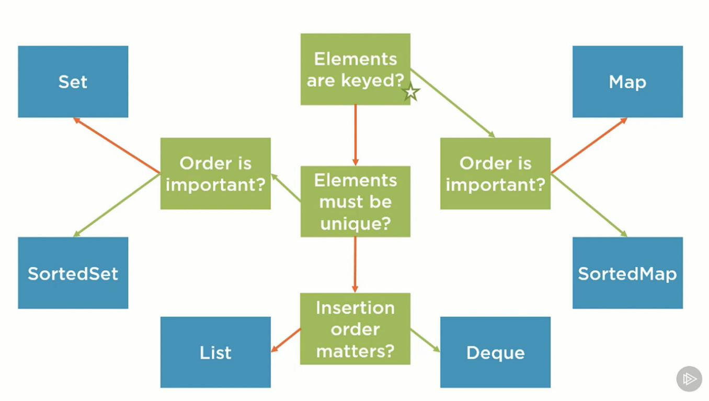

= Middle Java Developer Roadmap
:toc:
:toc-title: Content
:toclevels: 5

== Требования работодателя

=== Навыки

* Java DataBase Connectivity (JDBC)
* Java Message Service (JMS)
* Kafka
* PL/SQL
* автоматизированное тестирование
* анализ технических характеристик программного обеспечения
* использование многопоточного программирования
* Jenkins (инструменты управление конфигурацией программного обеспечения)
* Java Core
* Hibernate
* DevOps
* SQL
* Spring Framework
* Spring Boot
* Spring JPA
* Spring JDBC
* Spring Data
* Spring Web
* Spring Test

=== Функции

* Анализ данных проекта для определения спецификаций и требований
* Документирование процедур проектирования и разработки
* Написание компьютерного программного кода
* Разработка программных приложения
* Совместная работа с другими сотрудниками для решения проблем с информационными технологиями
* Тестирование программного обеспечения

== Mandatory skills

. <<git>>
. <<linux>>
. <<data_structure_and_algorithms>>
. <<http_ssl_rest_soap>>
. <<computer_science_fundamentals>>
. <<sql>>
. <<messaging>>
. <<design_patterns>>

=== Git & Github (more than basic commands)[[git]]

=== Linux (find, grep, netstat, etc; writing shell scripts)[[linux]]

=== Data structure & algorithms [[data_structure_and_algorithms]]

. Trie
. B-Tree
. AVL tree
. ...

=== OSI, HTTP/HTTPS, SSL, REST, SOAP,  [[http_ssl_rest_soap]]
. https://www.tutorialsteacher.com/https/how-ssl-works[how ssl works]
. https://superuser.com/questions/620121/what-is-the-difference-between-a-certificate-and-a-key-with-respect-to-ssl[difference between a certificate and a key with respect to ssl]

=== Computer science and fundamental [[computer_science_fundamentals]]

. Binary Number System & Operations
. Analyzing of algorithms
** Time-Complexity
** Logarithmic functions
** Factorial functions
** Algebraic Expressions
** n-notation
** Big O notation
. Arrays
. LinkedLists
. Stack and Queues
. Sorting algorithms
. Trees
. Heaps
. Graphs

=== SQL [[sql]]

https://www.youtube.com/playlist?list=PLaFqU3KCWw6JRuU5vpszIUDAVEBeI9XtS[dev1. sql development course youtube]

=== Message queue, kafka [[messaging]]

. https://medium.com/@bb8s/message-queue-overview-of-kafka-8e24cc9c56a6[mq: overview to kafka]
. https://medium.com/event-driven-utopia/understanding-kafka-topic-partitions-ae40f80552e8[Kafka topic partiotions]

=== Design patterns [[design_patterns]]

== Tools, frameworks, libraries & APIs

. <<tools>>
. <<java_api>>
. <<database>>
. <<frameworks>>
. <<testing>>
. <<utility_libraries>>

=== Tools [[tools]]

. IDEs 
. Build Tools (Maven, Graddle)
. Containers and DevOps Tools

=== Java APIs [[java_api]]

. <<java_collections>>
.. https://javarush.ipnodns.ru/[javarush topics]
. Garbage Collection
. Java Concurrency
. Java IO & NIO
. <<java_8_features>>

=== Java Collections Framework [[java_collections]]

=== Java 8 Features [[java_8_features]]

. Lambda expressions
. Stream API
. Optional classes
. Date & Time API

=== Database [[database]]

. JDBC

=== Frameworks [[frameworks]]

. <<spring_framework>>
. <<spring_boot>>
. <<hibernate>>
. <<java_microservice_frameworks>>

==== Spring Framework [[spring_framework]]
. https://www.youtube.com/watch?v=rd6wxPzXQvo&list=PLq7X6S3EAxp4KXdec8BWwt8gItZgoKvG-&index=1[Spring builder youtube from Evgeny Borizov 2h24m]
. https://www.youtube.com/watch?v=GL1txFxswHA[Spring patterns youtube from Evgeny Borisov 2h47m]

==== Spring Boot [[spring_boot]]

==== Hibernate [[hibernate]]

==== Java Microservice Frameworks — MicroProfile, Micronaut, and Quarkus [[java_microservice_frameworks]]

. Quarkus
. Eclipse microporfile
. Micronaut

=== Testing [[testing]]

. JUnit
. Mockito

=== Utility libraries [[utility_libraries]]

. Lombok

== Desktop & Frontend

questionable

== System design

. Scalability
.. https://www.youtube.com/watch?v=-W9F__D3oY4[Scalability Lecture at Harvard]
... Topics covered:
.... Vertical scaling
.... Horizontal scaling
.... Caching
.... Load balancing
.... Database replication
.... Database partitioning
.. http://www.lecloud.net/tagged/scalability/chrono[Scalability article 1]
... Topics covered:
.... Clones
.... Databases
.... Caches
.... Asynchronism
.. http://www.allthingsdistributed.com/2006/03/a_word_on_scalability.html[Scalability article 2]
.. http://www.slideshare.net/jboner/scalability-availability-stability-patterns/[Scalability article 3]
. Latency vs throughput
.. https://community.cadence.com/cadence_blogs_8/b/sd/archive/2010/09/13/understanding-latency-vs-throughput[Understanding latency vs throughput]
. Availability vs consistency
https://github.com/donnemartin/system-design-primer#availability-vs-consistency[To be continued]

== Полезные ссылки

. https://dzone.com/[DZone - рассылка про новости в мире it]
. https://javarush.ipnodns.ru/v[javarush course map]
. https://javarevisited.blogspot.com/2015/10/133-java-interview-questions-answers-from-last-5-years.html#axzz7jstm8cGW[130+ Java Interview Questions Answers for 2 to 7 Year Experienced Programmers]
. https://www.java67.com/2019/07/top-50-java-generics-and-collection-interview-questions.html[Top 50 Java Collections + Generics Interview Questions and Answers for 1 to 3 Years Experienced]
. https://javarevisited.blogspot.com/2011/11/collection-interview-questions-answers.html#axzz5Y4KkQFHS[Top 25 Java Collection Framework Interview Questions Answers for Freshers and Experienced Programmers]
. https://www.java67.com/2018/06/top-15-spring-boot-interview-questions-answers-java-jee-programmers.html[Top 15 Spring Boot Interview Questions with Answers for Java/JEE Programmers]
. https://www.java67.com/2012/08/spring-interview-questions-answers.html[Top 30 Spring Core, Spring MVC and Spring Security Interview Questions Answers]
. https://www.java67.com/2021/01/spring-cloud-interview-questions-with-answers-java.html[Top 15 Spring Cloud Interview Questions for Java Developers [with Answers]]

. https://cdn.otus.ru/media/public/34/15/3415ad_program_javaspring.pdf[otus java spring course program]

